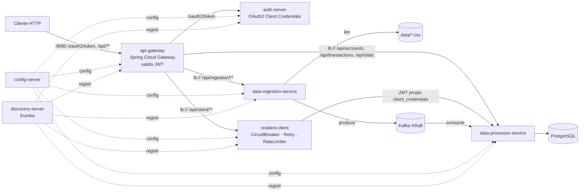

# kafka_S8 — Microservicios con Spring Cloud, OAuth 2.0, Resilience4j y Kafka

Ecosistema de microservicios (Java 21, Spring Boot 4.1, Spring Cloud 2025.1) que migra
los CSV legados de `data/` a PostgreSQL a través de Apache Kafka. Todo se orquesta con
Docker Compose y está preparado para desplegarse en una instancia AWS EC2.



## Servicios

| Servicio | Puerto | Rol |
|---|---|---|
| `config-server` | 8888 | Spring Cloud Config (`@EnableConfigServer`). Sirve `config-repo/` (perfil `native`) o un repositorio Git (perfil `git`). |
| `discovery-server` | 8761 | Eureka (`@EnableEurekaServer`), sin auto-registro. |
| `auth-server` | 9000 | Spring Authorization Server: emite JWT firmados con RSA mediante *Client Credentials*. Clientes en memoria y `JWKSource` propios. |
| `api-gateway` | 8080 | Punto de entrada único. Valida el JWT (Resource Server reactivo) y enruta con `lb://` vía Eureka. |
| `data-ingestion-service` | 8081 | Lee los CSV, valida y normaliza cada fila y la publica en Kafka. Las filas inválidas van a un topic de rechazados con sus motivos. |
| `data-processor-service` | 8082 | Consume los topics, persiste en PostgreSQL (upsert idempotente), calcula intereses y expone consultas REST. |
| `resilient-client` | 8083 | Consumidor síncrono del processor protegido con Resilience4j; expone `/actuator/circuitbreakers`. |
| `kafka` | 9092 (interno) | Apache Kafka 3.9 en modo KRaft (no necesita ZooKeeper). |
| `postgres` | 5432 (interno) | PostgreSQL 16. |

## Puesta en marcha

Requisitos: Docker con Compose v2. Las imágenes se compilan dentro de Docker (Dockerfile
multistage), así que no hace falta tener Java ni Maven en el host.

```bash
cp .env.example .env            # opcional: puertos, secretos, memoria
docker compose up -d --build --wait
scripts/demo.sh                 # flujo completo: token -> ingesta -> Kafka -> PostgreSQL -> consultas
scripts/circuit-breaker-demo.sh # apaga el processor y muestra CLOSED -> OPEN -> HALF_OPEN -> CLOSED
```

Paneles (enlazados solo a `127.0.0.1`): Eureka en http://localhost:8761, config en
http://localhost:8888/data-processor-service/default y estado de los circuit breakers en
http://localhost:8083/actuator/circuitbreakers.

### Desarrollo sin Docker

Cada servicio es un proyecto Maven independiente (`./mvnw test` o `mvn test` dentro de su
carpeta). Para ejecutarlos en local hay que levantar primero `config-server` y
`discovery-server`; los valores por defecto apuntan a `localhost` (Kafka en `localhost:9092`
y PostgreSQL en `localhost:5432/banking`, usuario y contraseña `banking`).

## Seguridad (OAuth 2.0 — Client Credentials)

| Cliente | Secreto (por defecto) | Scopes | Uso |
|---|---|---|---|
| `banking-client` | `banking-secret` | `data.read`, `ingestion.write` | Consumidores externos (scripts, Postman). |
| `resilient-client` | `resilient-secret` | `data.read` | Identidad de servicio de `resilient-client` para llamar al processor. |

```bash
TOKEN=$(curl -s -u banking-client:banking-secret \
  -d grant_type=client_credentials -d "scope=data.read ingestion.write" \
  http://localhost:8080/oauth2/token | jq -r .access_token)

curl -X POST -H "Authorization: Bearer $TOKEN" http://localhost:8080/api/ingestion/run
curl -H "Authorization: Bearer $TOKEN" http://localhost:8080/api/stats
```

- El gateway rechaza con `401` cualquier `/api/**` sin un JWT válido.
- Cada servicio vuelve a validar el token (defensa en profundidad) y aplica sus scopes:
  `POST /api/ingestion/**` exige `ingestion.write` y las lecturas exigen `data.read` (`403` si falta).
- Las claves públicas se publican en `/oauth2/jwks`. El par RSA se regenera en cada arranque
  del auth-server, así que después de reiniciarlo hay que pedir un token nuevo.

## API

| Método y ruta (vía gateway) | Scope | Descripción |
|---|---|---|
| `POST /api/ingestion/run` | `ingestion.write` | Ingesta completa de los 3 CSV; devuelve un informe por archivo y motivo de rechazo. `409` si ya hay una ingesta en curso. |
| `GET /api/ingestion/last-report` | `data.read` | Último informe de ingesta. |
| `GET /api/stats` | `data.read` | Filas persistidas por tabla y rechazadas por archivo. |
| `GET /api/stats/rejected?file=transacciones.csv&limit=20` | `data.read` | Muestra de filas rechazadas con sus motivos. |
| `GET /api/accounts` | `data.read` | Saldo neto y nº de movimientos por cuenta. |
| `GET /api/accounts/{id}/summary` | `data.read` | Movimientos por tipo, saldo neto, productos con interés e interés anual. |
| `GET /api/transactions/summary` | `data.read` | Totales de crédito y débito. |
| `GET /api/client/stats` · `/api/client/transactions/summary` · `/api/client/accounts/{id}/summary` | `data.read` | Lo mismo, pasando por `resilient-client` (sobre `{source, retrievedAt, data, error}`). |

## Arquitectura de eventos (Kafka)

| Topic | Particiones | Productor → Consumidor | Contenido |
|---|---|---|---|
| `interests-validated` | 3 | ingestion → processor | Filas válidas de `intereses.csv` |
| `transactions-validated` | 3 | ingestion → processor | Filas válidas de `transacciones.csv` |
| `annual-accounts-validated` | 3 | ingestion → processor | Filas válidas de `cuentas_anuales.csv` |
| `ingestion-rejected` | 1 | ingestion → processor | Filas inválidas + lista de motivos (auditoría) |
| `<topic>.DLT` | auto | processor | Mensajes que el consumidor no pudo procesar tras 3 reintentos |

- La clave de cada mensaje es `archivo:línea` (`sourceId`), que también es la clave
  primaria en PostgreSQL. Volver a ejecutar la ingesta o recibir un mensaje repetido
  actualiza la fila en lugar de duplicarla.
- Productor con `acks=all` e idempotencia activada. El informe de ingesta se devuelve
  después de que el broker confirme todos los envíos.
- Consumidor con `DefaultErrorHandler`: 3 reintentos separados por 1 s y después
  `DeadLetterPublishingRecoverer` (un JSON mal formado va directo a la DLT).

### Reglas de validación de los CSV legados

| Archivo | Se rechaza si… | Se normaliza |
|---|---|---|
| `intereses.csv` | `cuenta_id` vacío o no numérico; `nombre` vacío o `Unknown`; `saldo` vacío o negativo; `edad` fuera de 18–120 (p. ej. `150`); `tipo` distinto de `ahorro`/`prestamo`/`hipoteca` (`-1`, `unknown`) | `edad` vacía se admite como `null`; `tipo` pasa a minúsculas |
| `transacciones.csv` | `fecha` inválida (`2024-13-01`); `monto` vacío, cero o negativo; `tipo` distinto de `credito`/`debito` (`invalid`, `desconocido`) | Las 4 variantes de fecha (`yyyy-MM-dd`, `yyyy/MM/dd`, `dd-MM-yyyy`, `dd/MM/yyyy`) pasan a ISO-8601 |
| `cuentas_anuales.csv` | `fecha` inválida; `monto` vacío, cero o negativo; `transaccion` desconocida | Se quitan las tildes (`depósito` → `deposito`); `descripcion` vacía pasa a `null` |

Cada fila rechazada lista **todos** sus problemas. Resultado sobre los datos actuales:
1552 filas aceptadas y 1448 rechazadas (ver `docs/evidencia/demo-end-to-end.txt`).

El processor aplica las tasas anuales de `config-repo/data-processor-service.yml`
(ahorro 2,5 %, hipoteca 6,5 %, préstamo 12 %) y calcula el saldo neto de cada cuenta
(depósitos menos retiros, compras y pagos).

## Resiliencia (Resilience4j)

`DataProcessorClient` (en `resilient-client`) declara
`@CircuitBreaker(name = "dataProcessor", fallbackMethod = "fallback")` y `@Retry(name = "dataProcessor")`.
El circuit breaker envuelve al retry (`circuit-breaker-aspect-order: 1`, `retry-aspect-order: 2`),
así que una secuencia de reintentos agotada cuenta como un único fallo.

| Patrón | Configuración (`config-repo/resilient-client.yml`) |
|---|---|
| Circuit Breaker | Ventana de 10 llamadas, mínimo 4, abre con ≥ 50 % de fallos u ≥ 80 % de llamadas lentas (> 2 s); 15 s en OPEN y 2 llamadas de prueba en HALF_OPEN |
| Retry | 3 intentos con backoff exponencial (500 ms, 1 s) |
| Rate Limiter | `clientApi`: 20 peticiones/s por instancia; el exceso recibe `429` |
| Timeouts | Conexión 2 s, lectura 3 s |
| Fallback | Devuelve la última respuesta buena de ese recurso (`source: "cache"`) o un payload vacío (`source: "default"`). Los `4xx` del processor se propagan (no cuentan como caída). |

Monitorización: `/actuator/health`, `/actuator/circuitbreakers`,
`/actuator/circuitbreakerevents`, `/actuator/retries` y `/actuator/ratelimiters`.

## Despliegue en AWS EC2

1. Lanza una instancia **Amazon Linux 2023** de tipo `t3.large` (8 GB). Una `t3.medium`
   también arranca gracias al swap que crea el script, pero va más justa.
2. Security Group, reglas de entrada:

   | Puerto | Origen | Motivo |
   |---|---|---|
   | 22/tcp | Tu IP | SSH |
   | 80/tcp | 0.0.0.0/0 | API Gateway (`GATEWAY_PORT=80`) |
   | 443/tcp | 0.0.0.0/0 | Opcional, si se pone un proxy TLS o un ALB delante |

   Kafka, PostgreSQL y el resto de servicios solo existen en la red interna `backend`
   de Docker, y los paneles están enlazados a `127.0.0.1`. Para verlos, abre un túnel:
   `ssh -L 8761:localhost:8761 -L 8083:localhost:8083 ec2-user@<ip>`.
3. Pega `deploy/ec2-setup.sh` como *User data*, o ejecútalo por SSH:
   ```bash
   sudo REPO_BRANCH=main bash deploy/ec2-setup.sh
   ```
   El script instala Docker, Compose y buildx (`v0.37.1`; `docker compose build` exige
   buildx ≥ 0.17.0 y el paquete `docker` de Amazon Linux no lo trae), crea 2 GB de swap,
   clona el repositorio en `/opt/kafka-s8`, publica el gateway en el puerto 80 y ejecuta
   `docker compose up -d --build --wait`.

   Si en una instancia ya preparada aparece `compose build requires buildx 0.17.0 or later`,
   vuelve a ejecutar el script (instala buildx y retoma el arranque) o instala el plugin a mano:
   ```bash
   ARCH=$(uname -m | sed 's/x86_64/amd64/; s/aarch64/arm64/')
   sudo curl -fsSL "https://github.com/docker/buildx/releases/download/v0.37.1/buildx-v0.37.1.linux-${ARCH}" \
     -o /usr/local/lib/docker/cli-plugins/docker-buildx
   sudo chmod +x /usr/local/lib/docker/cli-plugins/docker-buildx
   docker buildx version && docker compose up -d --build --wait
   ```
4. Comprobación desde tu máquina: `GATEWAY_URL=http://<ip-publica> scripts/demo.sh`.

Cambia los secretos de `.env` (`BANKING_CLIENT_SECRET`, `RESILIENT_CLIENT_SECRET`,
`DB_PASSWORD`) antes de exponer la instancia.

## Evidencia de ejecución

Capturas reales del stack levantado con `docker compose`, en `docs/evidencia/`:

- `docker-compose-ps.txt`: los 9 contenedores en estado `healthy`.
- `eureka-registry.txt`: los 5 servicios registrados en Eureka.
- `demo-end-to-end.txt`: salida de `scripts/demo.sh` (401/403, token, informe de ingesta, consultas).
- `kafka-topics.txt`: topics creados y lag 0 del grupo `data-processor`.
- `circuit-breaker.txt`: transiciones CLOSED → OPEN → HALF_OPEN → CLOSED y fallback desde caché.

Tests automáticos (`mvn test` en cada módulo): emisión y rechazo de tokens, reglas de
validación, ingesta completa contra Kafka embebido, consumo idempotente con DLT sobre
H2, circuit breaker, retry, fallback y rate limiter.

## Matriz de cumplimiento

| Requisito | Estado | Dónde |
|---|---|---|
| OAuth 2.0 funcional (Client Credentials) | ✅ | `auth-server`, `SecurityConfig` de cada servicio, `resilient-client.yml` |
| Imágenes Docker de todos los servicios | ✅ | `*/Dockerfile` (multistage, JRE 21, usuario sin privilegios, healthcheck) |
| `docker-compose.yaml` funcional | ✅ | `docker-compose.yaml` |
| Resilience4j configurado | ✅ | `resilient-client` + `config-repo/resilient-client.yml` |
| Mensajería asíncrona con Kafka | ✅ | `data-ingestion-service` → Kafka → `data-processor-service` |
| Repositorio + README + evidencia | ✅ | Este README y `docs/evidencia/` |

### Notas respecto al informe técnico inicial

- El scaffolding ya venía con **Spring Boot 4.1.1 / Spring Cloud 2025.1.3** (no 3.x) y se
  mantuvo. Esto implica los nuevos nombres de starters (`spring-boot-starter-security-oauth2-*`,
  `spring-cloud-starter-gateway-server-webflux`) y Jackson 3 (`tools.jackson`).
- Kafka corre en **modo KRaft**, que sustituye a ZooKeeper.
- Se eliminó `discovery-server/bin/`, que era salida de compilación de Eclipse (`.class`)
  subida por error.
